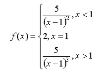

```{r setup, include=FALSE}
knitr::opts_chunk$set(echo = TRUE)

```

## CS636 Homework 2
Due on Feb 23 2019
Submit hardcopy in class
Submit electronic copy in moodle

Please submit the code together with the running results of the testing
commands.
Please do not use existing R packages and functions like sort(), order() and
so on.

#### 1，Write a function, F(x), which takes x asthe input parameter.It calculates and prints the value of the following mathematical function.


#### Testing commands: F(1); F(10); F(0.3);

```{r question1}
F <- function(x) {
  
  # if x < 1 then formula
  if(x<1){
  
    y <- 5/((x-1)^2)
  
  }else if(x==1){ # if x == 1 then 2
    
    y <- 2
  
  }else if(x>1){ # if x > 1 then formula
  
    y <-5/((x-1)^3)
  
  }
  
  return(y)
}

F(1)

F(10)

F(0.3)
```

#### 2， The Fibonacci sequence 1, 1, 2, 3, 5, 8, 13, 21…… starts with two 1s, and each term afterwards is the sum of its two predecessors. Please write a function, Fib(n), which takes n as the input parameter. It will return the n-th number in the Fibonacci sequence.
#### Testing commands: Fib(1); Fib(2); Fib(100);

```{r question2-1}
# Using List mehtod to calculate
Fib <- function(n){
  
  fiblist <- c()
  
  if (n==1){
    
    fiblist[1] <- 1
    
  }else if(n==2){
    
    fiblist[1] <- 1
    fiblist[2] <- 1
    
  }else{
  
    fiblist[1] <- 1
    fiblist[2] <- 1
    
    for (i in 3:n){

      fiblist[i] <- fiblist[i-2]+fiblist[i-1]

    }
  }

  # Turn Scientific Notation Off
  return(format(fiblist[n],scientific = FALSE))
  
}

Fib(1)

Fib(2)

Fib(100)
```
```{r question2-2}
# Using recursive methods to calculate the same.
# Using memoise library to improve CPU efficiency
library(memoise)
Fib <- memoise(function(n){
  
  
  
  if (n==1){
    
    return(1)
    
  }else if(n==2){
    
    return(1)
    
  }else{
  
    return(Fib(n-1)+Fib(n-2))

  }

  
})

Fib(1)

Fib(2)

Fib(100)

```

#### 3， The merge operation plays an important role in merge sort algorithm. Suppose you have two sorted sequences S1 and S2, merge operation will combine these two sequences into a single ordered sequence. Please write a function, Merge(S1, S2), which accepts two ordered vectors S1 and S2 as parameters. It will return a single ordered sequence. For example, S1 = c(1,3,5,7); S2=c(2,4,6,10); Merge(S1, S2) will return c(1,2,3,4,5,6,7,10)
#### Testing commands: Merge(seq(1, 50, by=3), seq(2, 30, by=2))

```{r question3}
# Merge Sort
Merge <- function (S1, S2){
  
  print("S1 contains:")
  print(S1)
  print("S2 contains:")
  print(S2)
  
  len1 <- length(S1)
  len2 <- length(S2)
  len <- len1 + len2
  
  S <- c()
  
  k1 <- 1
  k2 <- 1
  
  for (x in 1:len){
    
    if(k1>len1){
      S[x:len] <- S2[k2:len2]
      break
    }else if (k2>len2){
      S[x:len] <- S1[k1:len1] 
      break
    }else if(S1[k1]<S2[k2]){
      S[x] <- S1[k1]
      k1 <- k1+1
    }else{
      S[x] <- S2[k2]
      k2 <- k2+1
    }
  }
  
  print("After Merge:")
  return(S)
}

Merge(seq(1, 50, by=3), seq(2, 30, by=2))
```

#### 4， One of the most important algorithms is the quick sort, which is based on the quick sort partition. Here we implement a simple version of the partition function. Please write a function, Partition(pivot, vect), which takes two parameters. The function partitions the sequence, vect, into two parts (part1 <= pivot; part2 > pivot) based on the pivot. For example, Pivot = 6; Vect = c(1, 5, 3, 7, 9, 6, 4, 2, 10, 8); List = Partition(Pivot, Vect); List[[1]] is c(1,5,3,4,2, 6) and List[[2]] is c(7, 9, 10, 8). Note that Partition returns a list.
#### Testing commands: Partition(50, sample(1:100, 100, replace=F))

```{r question4-1}
# Partition list
Partition <- function(Pivot, vect){
  
  len = length(vect)
  list1 <- c()
  list2 <- c()
  k1 <- 1
  k2 <- 1
  
  for(x in 1:len){
    if (vect[x]<=Pivot){
      list1[k1] <- vect[x]
      k1 <- k1+1
    }else{
      list2[k2] <- vect[x]
      k2 <- k2+1
    }
    
  }
  
  listt = list(list1,list2)
  
  return(listt)
  
}

Partition(50, sample(1:100, 100, replace=FALSE))
```

```{r question4-2}
# Quick Sort
Quick <- function(vect){
  
  
  vavg <- mean(vect)
  
  list <- Partition(vavg,vect)
  
  len1 = length(list[[1]])
  len2 = length(list[[2]])

  if(len1>1){
    list1 <- Quick(list[[1]])
  }else{
    list1 <- list[[1]]
  }
  
  if(len2>1){
    list2 <- Quick(list[[2]])
  }else{
    list2 <- list[[2]]
  }
  
  
  listt = c(list1,list2)
  
  return(listt)
}

Quick(sample(1:100, 100, replace=FALSE))
```

